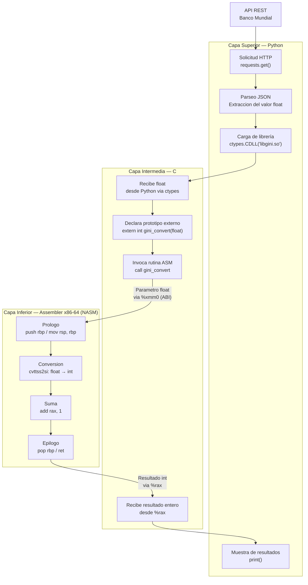

# Trabajo Practico N°2

## Calculadora de Indices

**Materia:** Sistemas de Computación  
**Grupo:** asm_noobs  
**Integrantes:** [Fabian Nicolas Hidalgo] · [Juan Manuel Caceres] · [Agustin Alvarez]

---

### Introducción

El presente trabajo práctico consiste en el diseño e implementación de un sistema multicapa para consultar y procesar el índice GINI desde la API del Banco Mundial. El sistema se estructura en tres capas:

- **Capa superior (Python):** consume la API REST y pasa los datos a la capa intermedia.
- **Capa intermedia (C):** recibe los datos flotantes y llama a rutinas en assembler.
- **Capa inferior (Assembler x86-64):** realiza la conversión de float a entero y le suma uno, devolviendo el resultado mediante el stack.

#### El índice GINI

Es una medida estadística que cuantifica la desigualdad en la distribución del ingreso dentro de una población. Su valor oscila entre 0 y 100, donde 0 representa una igualdad perfecta (todos los individuos tienen el mismo ingreso) y 100 representa una desigualdad máxima (una sola persona concentra todo el ingreso).

Los datos se obtienen de la API REST pública del Banco Mundial, que devuelve registros en formato JSON con el valor del índice GINI por país y por año. 

```
https://api.worldbank.org/v2/en/country/all/indicator/SI.POV.GINI?format=json&date=2011:2020&per_page=32500&page=1&country="Argentina"
```

#### Iteraciones

**Iteración 1 — Python + C sin Assembler:** se construye la arquitectura completa del sistema (consulta a la API, paso de datos a C, cálculo y muestra de resultados) usando solo Python y C. El objetivo es validar el flujo de datos y la integración entre capas antes de introducir assembler, de modo que los errores de lógica puedan aislarse de los errores de bajo nivel.

**Iteración 2 — Integración con Assembler:** se reemplaza la lógica de conversión `float → entero` y la operación de suma `+1` por una rutina escrita en NASM. C actúa como puente, invocando la función de Assembler y pasándole los parámetros conforme a la ABI. Se utiliza GDB para mostrar el estado del stack en los tres momentos clave de la llamada: antes, durante y después.

---

### Arquitectura

El sistema se organiza en tres capas con responsabilidades bien definidas. Los datos fluyen desde la API pública hacia abajo hasta el ensamblador, y el resultado procesado regresa hacia arriba hasta la presentación en pantalla.

#### Diagrama de flujo



#### Capa Superior — Python

Es la única capa con acceso a internet. Usa la librería `requests` para consultar la API REST del Banco Mundial y obtiene la respuesta en formato JSON. De esa respuesta extrae el valor del índice GINI como número de punto flotante (`float`). Luego, mediante `ctypes`, carga la librería compartida `libgini.so` compilada desde C y llama a la función de conversión pasándole ese valor. Finalmente recibe el resultado entero y lo muestra por pantalla.

*Tecnología de comunicación hacia abajo:* `ctypes.CDLL` + definición explícita de tipos de argumento y retorno.

#### Capa Intermedia — C

Actúa como puente entre el mundo de alto nivel y assembler. Su rol es recibir el `float` desde Python, declarar el prototipo de la función ensambladora con `extern`, e invocarla respetando la convención de llamadas **System V AMD64 ABI**. Cuando la rutina ASM retorna, C recoge el entero resultante desde el registro `%rax` y lo devuelve hacia Python.

C también es responsable de compilarse como librería compartida (`.so`), lo que permite que Python la cargue dinámicamente en tiempo de ejecución sin necesidad de un ejecutable separado.

*Tecnología de comunicación hacia abajo:* llamada a función con parámetros pasados por registro (`%xmm0` para el `float`) según la ABI, con resultado devuelto en `%rax`.

#### Capa Inferior — assembler x86-64 (NASM)

Es el núcleo de cómputo. Implementa la función `gini_convert`, que recibe el valor flotante del GINI, lo convierte a entero truncando los decimales mediante la instrucción `cvttss2si`, le suma 1, y devuelve el resultado en el registro `%rax`. Gestiona manualmente el stack frame, abre el frame con el prólogo (`push rbp` / `mov rsp, rbp`) y lo cierra con el epílogo (`pop rbp` / `ret`), respetando en todo momento las convenciones de la ABI para no corromper el estado del llamador.

*Tecnología de comunicación hacia arriba:* registro `%rax` como portador del valor de retorno, stack restaurado al estado previo a la llamada.

#### Integracion

El vínculo entre las tres capas se realiza mediante:

```bash
# 1. Compilar el modulo assembler
nasm -f elf64 -g gini_asm.asm -o gini_asm.o

# 2. Compilar C junto con el objeto ASM como libreria compartida
gcc -g3 -shared -fPIC -o libgini.so gini_calc.c gini_asm.o

# 3. Python carga la librería en tiempo de ejecución
# ctypes.CDLL('./libgini.so')
```

El resultado es un único archivo `libgini.so` que contiene tanto el código C como el código Assembler enlazados, que Python puede invocar como si fuera una librería nativa cualquiera.

---

### Iteracion #1

...

#### Python

...

#### C

...

---

### Iteracion #2

...

#### Assembler

...

#### C

...

---

### Call Conventions

...

#### Registros

...

#### Stack Frame

...

---

### GDB Analisis

...

#### Configuracion

...

#### Stack antes de `call`

...

#### Stack durante `call`

...

#### Stack despues de `call`

...

---

### Resultados

...

---

### Dificultades

...

---

### Conclusiones

...

---

### Referencias

[] - ref_one_ex

[] - ref_two_ex