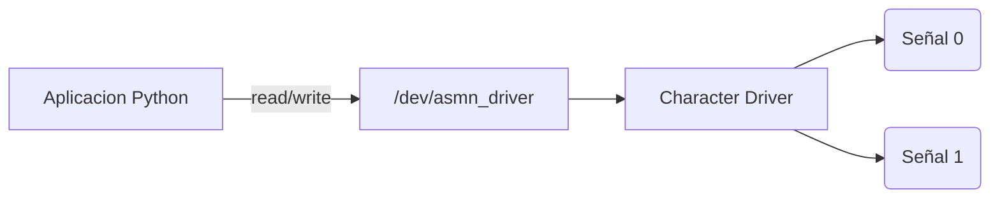

# Trabajo Practico N°5

## Character Device Driver

**Materia:** Sistemas de Computacion  
**Grupo:** asm_noobs  
**Integrantes:** [Fabian Nicolas Hidalgo] · [Juan Manuel Caceres] · [Agustin Alvarez]  
**Repositorio:** [Github](https://github.com/Nick07242000/SDC-asm-noobs/blob/main/TP_5)

---

### Introduccion

En este trabajo practico se desarrolla un Character Device Driver (CDD) para Linux capaz de sensar dos señales externas.

Este las muestrea cada un segundo, y permite que una aplicacion de usuario seleccione cual señal leer.

Finalmente grafica la señal seleccionada en funcion del tiempo.

---

### Objetivos

Se va a diseñar e implementar un Character Device Driver capaz de adquirir dos señales y exponerlas a una aplicacion de usuario.

El objetivo principal es comprender la arquitectura de drivers Linux, la comunicacion entre User Space y el Kernel Space, el uso de CDDs, el manejo de `/dev`, el uso de timers en kernel y el intercambio de datos mediante `read()` y `write()`.

---

### Descripcion del Sistema

El sistema desarrollado se divide en dos partes:

#### Kernel Space

Implementado mediante un Character Device Driver, que tiene como responsabilidad:

- Generar dos señales.
- Actualizarlas cada segundo.
- Administrar el canal seleccionado.
- Entregar datos a user-space.

#### User Space

Aplicacion Python encargada de:

- Leer datos desde `/dev/asmn_driver`
- Graficar la señal.
- Permitir cambio de canal.
- Resetear el grafico.



---

### Desarrollo del Driver

#### Modulo Basico

El primer paso fue crear un modulo basico del kernel.

En Linux, todo modulo posee dos funciones principales, una de inicializacion, y una de finalizacion.

La de inicializacion se ejecuta cuando el modulo es cargado con `insmod`, mientras que la de finalizacion se ejecuta cuando el modulo es removido utilizando `rmmod`.

Las macros `module_init` y `module_exit` permiten registrar estas funciones dentro del kernel.

```c
#include <linux/module.h>
#include <linux/kernel.h>

static int __init asmn_init(void)
{
    printk(KERN_INFO "ASMN Driver loaded\n");
    return 0;
}

static void __exit asmn_exit(void)
{
    printk(KERN_INFO "ASMN Driver unloaded\n");
}

module_init(asmn_init);
module_exit(asmn_exit);

MODULE_LICENSE("GPL");
MODULE_AUTHOR("asm_noobs");
MODULE_DESCRIPTION("TP5 Character Device Driver");
```

Inicialmente el modulo solamente imprimía mensajes utilizando `printk()` para verificar correctamente la carga del modulo, la descarga y la visualizacion de mensajes en `dmesg`.

Para validar cada etapa del modulo se genero un makefile y un script para permitirnos visualizar la carga, descarga y ejecucion del modulo.

> [!IMPORTANT]
> Foto de validacion

Este módulo solo es código cargado en kernel-space que no existe /dev, nadie puede usarlo y no hay archivo.

#### Character Device Driver

Una vez validado el modulo basico el siguiente paso fue convertirlo en un Character Device Driver. El CDD es la interfaz que Linux usa para hablar con el módulo.

Para que Linux pueda asociar un archivo dentro de `/dev` con nuestro driver fue necesario registrar un numero major,minor.

El numero major identifica al driver dentro del kernel mientras que el minor identifica una instancia específica del dispositivo.

Para esto se utilizó `alloc_chrdev_region()` porque permite que el kernel asigne automáticamente un major libre evitando conflictos con otros dispositivos del sistema.

Aqui le estamos diciendo al kernel que este módulo sabe manejar un dispositivo de caracteres.

Al codigo incorporamos la estructura `struct cdev` la cual representa internamente el dispositivo de caracteres dentro del kernel.

Por medio de `cdev_init()` y `cdev_add()` asociamos las operaciones del driver con el dispositivo recién registrado.

```c
#include <linux/module.h>
#include <linux/kernel.h>
#include <linux/cdev.h>
#include <linux/cdev.h>

#define DEVICE_NAME "asmn_driver"

static dev_t dev_num;
static struct cdev asmn_cdev;

static int __init asmn_init(void)
{
    alloc_chrdev_region(&dev_num, 0, 1, DEVICE_NAME);

    cdev_init(&asmn_cdev, NULL);
    cdev_add(&asmn_cdev, dev_num, 1);

    printk(KERN_INFO "ASMN Driver registered. Major=%d\n", MAJOR(dev_num));

    return 0;
}

static void __exit asmn_exit(void)
{
    cdev_del(&asmn_cdev);

    unregister_chrdev_region(dev_num, 1);

    printk(KERN_INFO "ASMN Driver unloaded\n");
}

module_init(asmn_init);
module_exit(asmn_exit);

MODULE_LICENSE("GPL");
MODULE_AUTHOR("asm_noobs");
MODULE_DESCRIPTION("TP5 Character Device Driver");
```

Hasta este punto el módulo existía dentro del kernel pero Linux todavía no sabía cómo interactuar con él como dispositivo.

> [!IMPORTANT]
> Foto de validacion

Inicialmente generamos el archivo asociado dentro de dev de forma manual dentro del script:

```bash
sudo mknod ${DEVICE_NAME} c ${MAJOR} 0
sudo chmod 666 ${DEVICE_NAME}
```

#### File Operations

Una vez registrado el dispositivo se definio qué acciones realizaría el driver cuando un programa de usuario intentara interactuar con él.

En Linux todas las operaciones de un Character Device se describen mediante la estructura `struct file_operations` que funciona como una tabla de funciones que el kernel invoca automáticamente cuando ocurre alguna operación sobre el archivo del dispositivo.

Implementamos las operaciones minimas necesarias `open`, `release`, `read` y `write` para la comunicación user-space y kernel-space.

La estructura quedó definida como:

```C
static struct file_operations fops = {
    .owner = THIS_MODULE,
    .open = asmn_open,
    .release = asmn_release,
    .read = asmn_read,
    .write = asmn_write,
};
```

A partir de aquí cualquier programa que accediera a `/dev/asmn_driver` ejecutaría automáticamente las funciones correspondientes del módulo.

Por ejemplo `cat /dev/asmn_driver` genera internamente `open()`, `read()` y `release()`.

> [!IMPORTANT]
> Foto de validacion

#### Generacion de Señales

Una vez establecida la comunicación básica el siguiente objetivo fue incorporar las señales requeridas por el TP.

En lugar de utilizar hardware real desde el comienzo se decidió generar señales simuladas dentro del kernel.

Se implementaron dos señales para disponer de dos fuentes de datos diferentes sobre las cuales trabajar.
- Señal 0 : Una señal periódica creciente simulando una onda.
- Señal 1 : Una señal aleatoria utilizando `prandom_u32()`.

```C
static int signal_0 = 0;
static int signal_1 = 0;

static int counter = 0;

static void generate_signals(void)
{
    signal_0 = (counter % 20) * 5;
    signal_1 = get_random_u32() % 100;
    counter++;
}
```

Asi podemos ver en la lectura el valor generado por la señal simulada:

> [!IMPORTANT]
> Foto de validacion

Para que las señales fueran muestreadas cada 1 segundo se implementó un timer del kernel utilizando `struct timer_list`.

El timer fue configurado para ejecutar periódicamente la generacion de las señales.

Posteriormente el timer se rearmaba utilizando `mod_timer()`.

```C
static void timer_callback(struct timer_list *t)
{
    generate_signals();
    printk(KERN_INFO "Signal0=%d Signal1=%d\n", signal_0, signal_1);
    mod_timer(&asmn_timer, jiffies + msecs_to_jiffies(1000));
}

static int __init asmn_init(void)
{
    alloc_chrdev_region(&dev_num, 0, 1, DEVICE_NAME);

    cdev_init(&asmn_cdev, &fops);
    cdev_add(&asmn_cdev, dev_num, 1);

    timer_setup(&asmn_timer, timer_callback, 0);
    mod_timer(&asmn_timer, jiffies + msecs_to_jiffies(1000));

    printk(KERN_INFO "ASMN Driver registered. Major=%d\n", MAJOR(dev_num));

    return 0;
}
```

Esto permitió que el driver funcionara de manera autónoma generando nuevas muestras periódicamente sin intervención de la aplicación de usuario.

> [!IMPORTANT]
> Foto de validacion

#### Lectura de Señales

Una vez que el driver ya generaba señales periódicamente el siguiente paso fue permitir que un programa de usuario pudiera leerlas.

Para esto se completo la funcion `asmn_read()` para identificar qué canal estaba seleccionado, obtener el valor correspondiente, formatearlo como texto y copiarlo a user-space.

```C
static ssize_t asmn_read(struct file *file, char __user *buf, size_t len, loff_t *off)
{
    char message[64];

    int value;
    int bytes;

    if (*off > 0) return 0;

    if (selected_channel == 0) value = signal_0;
    else value = signal_1;

    bytes = sprintf(message, "%d,%d\n", counter, value);

    if (copy_to_user(buf, message, bytes)) return -EFAULT;

    *off += bytes;

    return bytes;
}
```

Vemos ahora como haciendo `cat /dev/asmn_driver` en el paso doce de validacion podemos leer los valores sensados:

> [!IMPORTANT]
> Foto de validacion

La copia de memoria se realizó utilizando `copy_to_user()` porque el kernel no puede acceder directamente a memoria de usuario de manera segura.

Durante esta etapa apareció un problema importante donde `cat` realizaba múltiples lecturas sucesivas porque el kernel esperaba recibir un EOF.

La solución consistió en utilizar `if (*off > 0) return 0;` para indicar correctamente el final de archivo luego de una lectura completa.