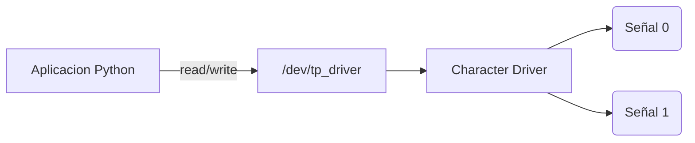

# Trabajo Practico N°5

## Character Device Driver

**Materia:** Sistemas de Computacion  
**Grupo:** asm_noobs  
**Integrantes:** [Fabian Nicolas Hidalgo] · [Juan Manuel Caceres] · [Agustin Alvarez]  
**Repositorio:** [Github](https://github.com/Nick07242000/SDC-asm-noobs/blob/main/TP_5)

---

### Introduccion

En este trabajo practico se desarrolla un Character Device Driver (CDD) para Linux capaz de sensar dos señales externas.

Este las muestrea cada un segundo, y permite que una aplicacion de usuario seleccione cual señal leer.

Finalmente grafica la señal seleccionada en funcion del tiempo.

---

### Objetivos

Se va a diseñar e implementar un Character Device Driver capaz de adquirir dos señales y exponerlas a una aplicacion de usuario.

El objetivo principal es comprender la arquitectura de drivers Linux, la comunicacion entre User Space y el Kernel Space, el uso de CDDs, el manejo de `/dev`, el uso de timers en kernel y el intercambio de datos mediante `read()` y `write()`.

---

### Descripcion del Sistema

El sistema desarrollado se divide en dos partes:

#### Kernel Space

Implementado mediante un Character Device Driver, que tiene como responsabilidad:

- Generar dos señales.
- Actualizarlas cada segundo.
- Administrar el canal seleccionado.
- Entregar datos a user-space.

#### User Space

Aplicacion Python encargada de:

- Leer datos desde `/dev/tp_driver`
- Graficar la señal.
- Permitir cambio de canal.
- Resetear el grafico.



---

### Desarrollo del Driver

#### Modulo Basico

El primer paso fue crear un modulo basico del kernel.

En Linux, todo modulo posee dos funciones principales, una de inicializacion, y una de finalizacion.

La de inicializacion se ejecuta cuando el modulo es cargado con `insmod`, mientras que la de finalizacion se ejecuta cuando el modulo es removido utilizando `rmmod`.

Las macros `module_init` y `module_exit` permiten registrar estas funciones dentro del kernel.

```c
#include <linux/module.h>
#include <linux/kernel.h>

static int __init asmn_init(void)
{
    printk(KERN_INFO "ASMN Driver loaded\n");
    return 0;
}

static void __exit asmn_exit(void)
{
    printk(KERN_INFO "ASMN Driver unloaded\n");
}

module_init(asmn_init);
module_exit(asmn_exit);

MODULE_LICENSE("GPL");
MODULE_AUTHOR("asm_noobs");
MODULE_DESCRIPTION("TP5 Character Device Driver");
```

Inicialmente el modulo solamente imprimía mensajes utilizando `printk()` para verificar correctamente la carga del modulo, la descarga y la visualizacion de mensajes en `dmesg`.

Para validar cada etapa del modulo se genero un makefile y un script para permitirnos visualizar la carga, descarga y ejecucion del modulo.

> [!IMPORTANT]
> Foto de validacion

#### Character Device Driver

Una vez validado el modulo basico el siguiente paso fue convertirlo en un Character Device Driver. 

Para que Linux pueda asociar un archivo dentro de `/dev` con nuestro driver fue necesario registrar un numero major, minor.

El numero major identifica al driver dentro del kernel mientras que el minor identifica una instancia específica del dispositivo.

Para esto se utilizó `alloc_chrdev_region()` porque permite que el kernel asigne automáticamente un major libre evitando conflictos con otros dispositivos del sistema.

Al codigo incorporamos la estructura `struct cdev` la cual representa internamente el dispositivo de caracteres dentro del kernel.

Por medio de `cdev_init()` y `cdev_add()` asociamos las operaciones del driver con el dispositivo recién registrado.

```c
#include <linux/module.h>
#include <linux/kernel.h>
#include <linux/cdev.h>
#include <linux/cdev.h>

#define DEVICE_NAME "asmn_driver"

static dev_t dev_num;
static struct cdev asmn_cdev;

static int __init asmn_init(void)
{
    alloc_chrdev_region(&dev_num, 0, 1, DEVICE_NAME);

    cdev_init(&asmn_cdev, NULL);
    cdev_add(&asmn_cdev, dev_num, 1);

    printk(KERN_INFO "ASMN Driver registered. Major=%d\n", MAJOR(dev_num));

    return 0;
}

static void __exit asmn_exit(void)
{
    cdev_del(&asmn_cdev);

    unregister_chrdev_region(dev_num, 1);

    printk(KERN_INFO "ASMN Driver unloaded\n");
}

module_init(asmn_init);
module_exit(asmn_exit);

MODULE_LICENSE("GPL");
MODULE_AUTHOR("asm_noobs");
MODULE_DESCRIPTION("TP5 Character Device Driver");
```

Hasta este punto el módulo existía dentro del kernel pero Linux todavía no sabía cómo interactuar con él como dispositivo.

> [!IMPORTANT]
> Foto de validacion
